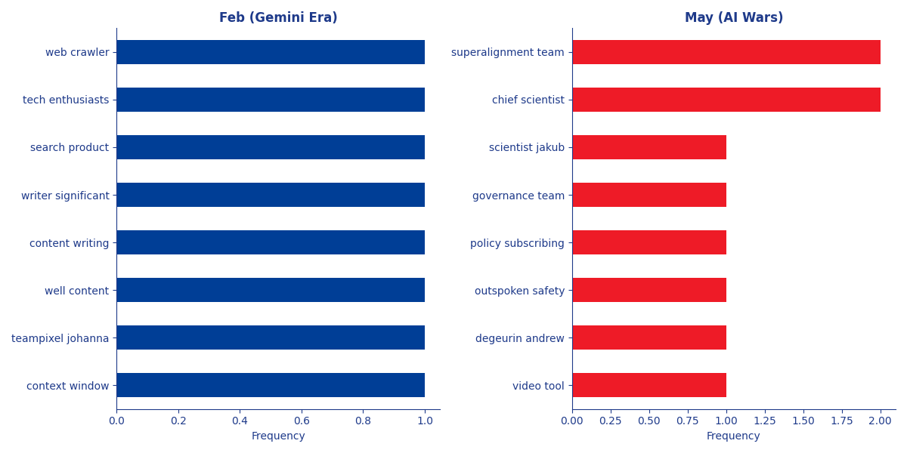

# Executive AI Narrative Report: The Shift from "Read" to "Sense"

## 1. Executive Summary
This analysis tracks the evolution of AI media coverage from **February 2024** (Gemini 1.5 launch) to **May 2024** (GPT-4o & Google I/O).
The data reveals a decisive shift from **text-based capability** (processing large documents) to **multimodal interaction** (voice, video, and real-time demos).

## 2. Key Findings

### A. February: The "Capacity" Narrative
* **Dominant Theme:** *Processing Power & Memory*
* **Key Phrases:** context window, teampixel johanna, well content, content writing, writer significant, search product, tech enthusiasts, web crawler
* **Insight:** The conversation was dominated by the "Context Window" (1 Million Tokens). The industry was focused on how much *data* an LLM could "read" at once.

### B. May: The "Experience" Narrative
* **Dominant Theme:** *Human Interaction & Latency*
* **Key Phrases:** chief scientist, superalignment team, video tool, degeurin andrew, outspoken safety, policy subscribing, governance team, scientist jakub
* **Insight:** The launch of GPT-4o shifted the goalposts to *speed* and *voice*. The appearance of "Veo" and "Sora" keywords also marks the beginning of the "Generative Video" war.

## 3. The "Modality War"
We quantified the frequency of words related to **Text** (reading), **Audio** (speaking), and **Video** (watching).
* **February:** Heavily skewed towards Text/Code concepts.
* **May:** Shows a massive spike in Audio/Video terminology.

## 4. Competitive Landscape
* **Google's Position:** In Feb, Google led the "Capacity" narrative. By May, they were fighting a two-front war: defending against GPT-4o's voice mode while simultaneously pushing **Veo** to compete in video.
* **OpenAI's Position:** Successfully reframed the conversation from "Specs" (parameters) to "Vibes" (latency, voice).

